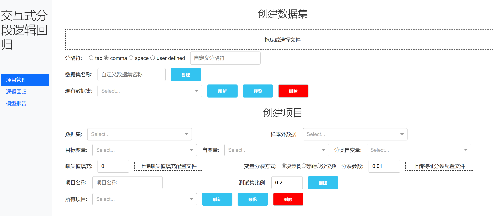
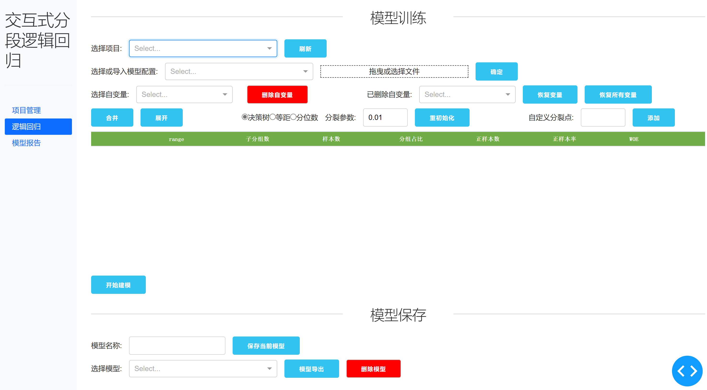
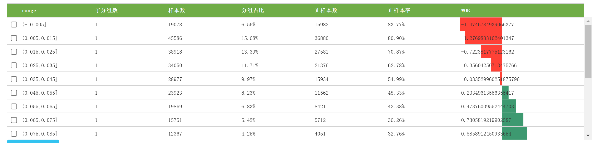
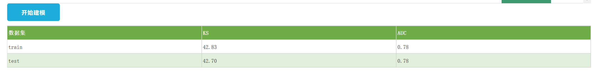
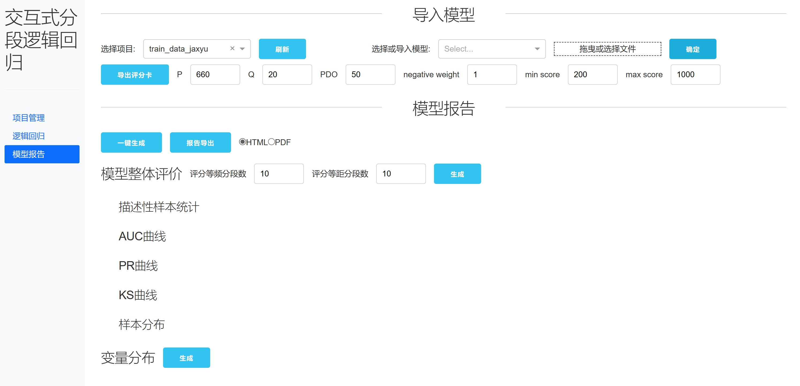

# Interactive Binned LinearRegression

这是一个基于[Dash](https://dash.plotly.com/introduction)的交互式逻辑回归(评分卡)实现。

## 目录

- [Interactive Binned LinearRegression](#interactive-binned-linearregression)
  - [目录](#目录)
  - [背景](#背景)
  - [安装](#安装)
  - [使用](#使用)
    - [1. 项目管理](#1-项目管理)
    - [2. 模型训练](#2-模型训练)
    - [3. 模型报告](#3-模型报告)
  - [维护者](#维护者)
  - [License](#license)

## 背景

逻辑回归是简单常用的二分类模型，但要求自变量和因变量之间存在较强的线性关系。一个可行的解决办法是，在建模之前先用因变量的均值编码自变量(Mean Encoding)，加强自变量和因变量之间的线性相关。这个过程需要人工的介入，以决定自变量的合理分段，因此才需要交互式的方案。
这种方法在信贷风控领域较为常用，也可以推广到其他的场景中。

## 安装

Python>=3.7.0，并安装相关依赖：

```
git clone https://github.com/lesliexufdu/Interactive-Binned-LinearRegression.git
cd ./Interactive-Binned-LinearRegression
pip install -r requirements.txt
```

## 使用

1. 单机运行项目下的`app.py`：`gunicorn -c config.py app:server`。
2. 打开浏览器，访问：http://127.0.0.1:8050/。

如想修改端口，将`app.py`文件中的`app.run_server(debug=False)`改成`app.run_server(port=XXXX, debug=True)`即可。

本项目包含项目管理、逻辑回归、模型报告三个页面。

### 1. 项目管理

在进行任何模型工作之前，必须先创建建模使用的项目，其中包括数据集和项目配置。



1. 上传csv格式的数据，创建数据集。
2. 选择已上传的数据集，选择其中的目标变量、自变量以及自变量中的分类变量。
    1. 如果数据中包含缺失值，可以使用一个值进行填充；若希望每个变量的缺失值以不同的值填充，可上传缺失值配置的HJSON文件，格式为`{变量名1:填充值1,...}`。
    2. **变量分裂方式**是指每个数值变量默认的初始分裂方式，可以选择决策树(参数是树的叶子节点最小样本占比)、等距离分段(参数是分段数)、分位数分段(参数是分段数)三种，同样可以上传HJSON配置文件以为每一个变量选择不同的分裂方式，格式为`{变量名1:{"split_method":XXX,"split_parameter":XXX},...}`。分类型变量的每个分立值都是一个区间，不受分裂方式影响。
    3. 项目会用等比例分层抽样的方式为每个数据集创建训练集和测试集。如果需要加入额外的验证集，请上传另一个数据集并在**样本外数据**下拉框里选中，该数据集将在模型评价时作为oot(out of train)数据。

### 2. 模型训练



1. 选择已创建的项目进行模型训练

对于每一个自变量，可以观察其分段后每一段的表现：

对于数值型变量，表格按照值的大小排序；对于分类型变量，按照WOE值的大小排序。

WOE值代表每个分段中正样本和负样本的分布差，计算公式是：
$$WOE_{i} = ln(\frac{N_i/N_T}{P_i/P_T})$$
其中$N_i$是当前分段负样本的数量，$P_i$是当前分段正样本的数量，$N_T$是训练样本中负样本的数量，$P_T$是训练样本中负样本的数量。
WOE的绝对值越大，代表该分段下正负样本的差异越明显。

可以选中一些分段后点击合并，则选中的分组就会合并在一起；选中被合并的分组点击展开，原分组则会重新分开。**注意**数值型变量不允许跨区域合并，如果跳跃地选择不连续的多选区域，则合并时中间的所有区间都会被合并在一起。
如果一个自变量无论无何合并分段区间都无法达到满意的效果，可以删除。

自变量调整完毕后，点击开始建模，等到出现模型表现的表格，表示建模完成：

这里只展示两个指标：KS(正样本和负样本的双样本KS检验结果)和AUC。

2. 模型保存

点击**保存当前模型**，当前的变量配置和模型参数都会保存在对应文件夹。
保存或导出的模型配置，可以用在下一次类似样本建模时导入(只有自变量分段信息在导入时是有效的)。

### 3. 模型报告



选择项目并导入模型配置信息。

点击导出评分卡，会输出SQL格式的评分代码。评分和逻辑回归预测概率的关系是：

$$
Odds = (1-probability) * negative_weight/probability \\
B = -PDO/np.log(2) \\
A = P + B * np.log(Q) \\
score = A - B * np.log(Odds)
$$

其中，Odds是预测为负样本和预测为正样本的概率之商；negative_weight是建模样本中负样本的抽样倍数，例如如果将原始样本的负样本抽取50%作为建模样本的负样本，negative_weight就应该是2；P是Odds等于Q时score的值；PDO是Odds为2Q时score的增加量。

点击**一键生成**按钮生成模型报告。个别指标会将score等频或等距分成若干段后统计，可以改变分段数后重新生成报告。
支持导出HTML或PDF格式的报告。

## 维护者

[@lesliexufdu](https://github.com/lesliexufdu)

## License

[MIT](LICENSE) © Leslie Xu